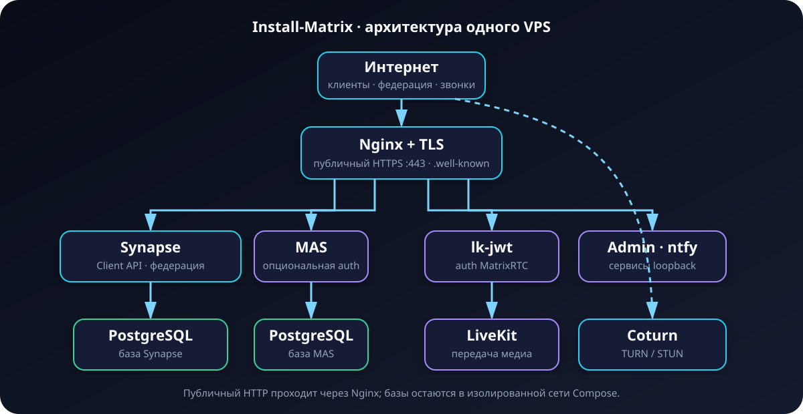
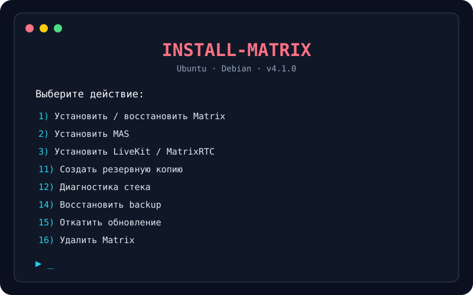
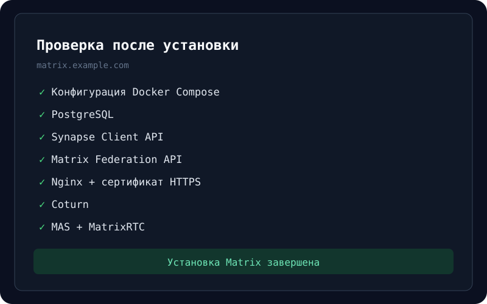
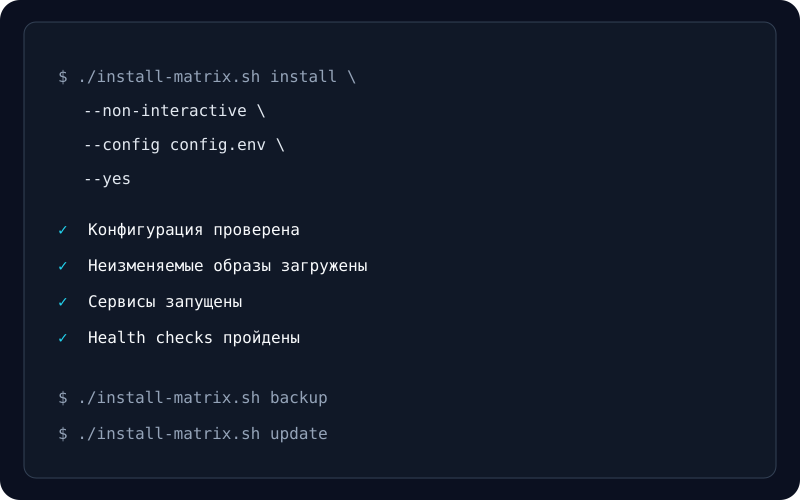

# Install-Matrix

[Русская документация](README.MD)

> **The easiest way to deploy a production-ready Matrix Synapse server on a regular VPS.**

One installer for Synapse, PostgreSQL, Nginx, Let's Encrypt and Coturn, with optional MAS, MatrixRTC/LiveKit, admin panels, ntfy and an outbound Xray proxy.

[](https://github.com/HubbaBubbaPrepod/Install-Matrix/actions/workflows/ci.yml)
[](https://github.com/HubbaBubbaPrepod/Install-Matrix/actions/workflows/security.yml)
[](https://github.com/HubbaBubbaPrepod/Install-Matrix/releases)
[](LICENSE)

[Quick start](#quick-start) · [Documentation](#documentation) · [CLI](#cli-and-automation) · [Issues](https://github.com/HubbaBubbaPrepod/Install-Matrix/issues)



## What does it install?

| Component | Status | Purpose |
|---|---|---|
| Matrix Synapse | Included | Homeserver and federation |
| PostgreSQL | Included | Production database |
| Coturn | Included | TURN/STUN for calls |
| Nginx | Included | TLS termination and reverse proxy |
| Let's Encrypt | Included | Automatic HTTPS certificates |
| UFW | Included | Host firewall; current SSH port is preserved |
| Matrix Authentication Service | Optional | Next-generation Matrix authentication |
| LiveKit + lk-jwt-service | Optional | MatrixRTC media backend |
| Ketesa / Element Admin | Optional | Administration interfaces |
| ntfy | Optional | UnifiedPush endpoint |
| Xray/VLESS | Optional | Outbound container HTTP(S) proxy |

## Why Install-Matrix?

Most Matrix deployments require wiring together a database, reverse proxy, TLS, TURN, federation discovery and backups. Install-Matrix keeps the simple interactive experience while also exposing a reproducible CLI for cloud-init, Ansible and CI.

- secure defaults, but explicit `closed`, `token` and `open` registration modes;
- version-pinned images and immutable external installer downloads;
- backup, checksum verification, restore, update and image rollback;
- remove-services/keep-data and full-purge uninstall modes;
- post-install checks for PostgreSQL, Synapse, Coturn, TLS, federation, MAS, MatrixRTC and ntfy;
- static coverage of every valid component combination on Ubuntu and Debian containers.

This project focuses on the straightforward single-VPS path. If you need a highly customized, multi-host Ansible deployment, consider `matrix-docker-ansible-deploy` instead.

## Quick start

### Recommended: release asset with checksum

```bash
VERSION=v4.1.0
curl -fLO "https://github.com/HubbaBubbaPrepod/Install-Matrix/releases/download/${VERSION}/install-matrix.sh"
curl -fLO "https://github.com/HubbaBubbaPrepod/Install-Matrix/releases/download/${VERSION}/SHA256SUMS"
sha256sum --check --ignore-missing SHA256SUMS
less install-matrix.sh
chmod +x install-matrix.sh
sudo ./install-matrix.sh
```

Do not execute an unreviewed mutable branch directly as root. Every tagged release is built by GitHub Actions and includes `SHA256SUMS`.

### One-line download and launch

```bash
VERSION=v4.1.0; curl -fsSLo install-matrix.sh "https://github.com/HubbaBubbaPrepod/Install-Matrix/releases/download/${VERSION}/install-matrix.sh" && chmod +x install-matrix.sh && sudo ./install-matrix.sh
```

The installer writes the deployment to `/root/matrix-server`.

## DNS before installation

Assume the Matrix ID domain is `example.com` and the server IPv4 is `203.0.113.10`.

| Purpose | DNS name | Required |
|---|---|---|
| Matrix IDs and `.well-known` delegation | `example.com` | Yes |
| Matrix Client/Federation API | `matrix.example.com` | Yes |
| MAS | `mas.example.com` | When MAS is enabled |
| MatrixRTC | `livekit.example.com` | When LiveKit is enabled |
| Ketesa | `admin.example.com` | When enabled |
| Element Admin | `element-admin.example.com` | When enabled |
| ntfy | `ntfy.example.com` | When enabled |

All records must resolve directly to the server while Let's Encrypt certificates are issued. Do not publish `AAAA` until IPv6 is configured end to end. Existing CAA records must allow `letsencrypt.org`.

## Supported systems

The CI matrix renders and validates every configuration on the following userspaces. Real installation tests run through the manual disposable-VM E2E workflow before a production release.

| OS | Version | CI render | Production release gate |
|---|---:|:---:|:---:|
| Ubuntu | 20.04 | ✅ | Manual E2E |
| Ubuntu | 22.04 | ✅ | Manual E2E |
| Ubuntu | 24.04 | ✅ | Manual E2E |
| Debian | 11 | ✅ | Manual E2E |
| Debian | 12 | ✅ | Manual E2E |
| Debian | 13 | ✅ | Manual E2E |

Supported CPU architecture is currently `amd64`. Other architectures may work when every selected image provides a matching manifest, but are not release-gated yet.

## Registration modes

| Mode | Behaviour |
|---|---|
| `closed` | New accounts are disabled |
| `token` | Registration requires a Synapse/MAS token |
| `open` | Registration without a token; explicit risk confirmation is required |

Open registration is intentionally available, but it can attract automated account creation and abuse. Non-interactive use requires both `REGISTRATION_MODE=open` and `--allow-open-registration`.

## CLI and automation

```bash
sudo ./install-matrix.sh --help
sudo ./install-matrix.sh diagnose
sudo ./install-matrix.sh backup
sudo ./install-matrix.sh verify-backup latest
sudo ./install-matrix.sh restore latest
sudo ./install-matrix.sh update
sudo ./install-matrix.sh rollback
sudo ./install-matrix.sh uninstall --keep-data
```

Non-interactive deployment:

```bash
sudo ./install-matrix.sh install \
  --non-interactive \
  --config config.env \
  --yes
```

Validate and render without modifying the operating system:

```bash
./install-matrix.sh install --dry-run --config config.env
```

Copy [`config.example`](config.example) and keep the real file outside version control. Admin passwords are read from `ADMIN_PASSWORD_FILE`, never from a command-line argument.

## Network ports

| Ports | Component |
|---|---|
| Current SSH port, `80/tcp`, `443/tcp` | Host access and HTTPS |
| `3478/tcp+udp`, `5349/tcp+udp`, `49152-49252/udp` | Coturn |
| `7881/tcp`, `50000-50100/udp` | LiveKit when enabled |

Application HTTP ports bind only to `127.0.0.1`. Federation is served on `443`; public `8448` is unnecessary.

## Post-install result

The installer finishes with a unified health report:

```text
✓ Docker Compose config
✓ PostgreSQL
✓ Synapse
✓ Coturn
✓ Nginx and HTTPS
✓ Matrix Client API
✓ Matrix Federation API
✓ MAS / LiveKit / ntfy (when enabled)
```

Credentials are written with mode `0600` to `/root/matrix-server/credentials.txt`. Secrets are not repeated in the final terminal banner.

## Documentation

- [Backup and disaster recovery](BACKUP.md)
- [Updates and rollback](UPDATE.md)
- [Uninstall](UNINSTALL.md)
- [Security policy and hardening](SECURITY.md)
- [FAQ](docs/FAQ.md)
- [Architecture](docs/ARCHITECTURE.md)
- [Contributing](CONTRIBUTING.md)
- [Support](SUPPORT.md)
- [Code of Conduct](CODE_OF_CONDUCT.md)
- [Changelog](CHANGELOG.md)

## Screenshots

| Interactive menu | Health report | Automation |
|---|---|---|
|  |  |  |

## Development

```bash
bash -n install-matrix.sh tests/*.sh
shellcheck --severity=warning -x -e SC1091 install-matrix.sh tests/*.sh
bash tests/static-render.sh
bash tests/cli.sh
bash tests/lifecycle.sh
bash tests/supply-chain.sh
```

CI additionally runs yamllint, markdownlint, Trivy, Gitleaks, zizmor and a six-distribution render matrix. The E2E workflow targets a dedicated disposable self-hosted VM with real DNS.

## License

[MIT](LICENSE). Security issues should be reported according to [SECURITY.md](SECURITY.md), not through a public issue.
